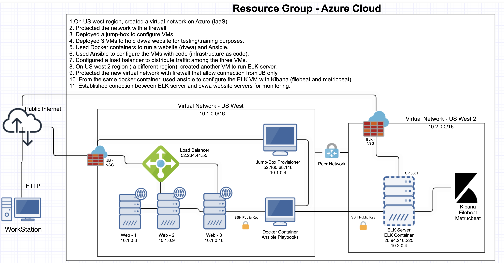

## Automated ELK Stack Deployment

The files in this repository were used to configure the network depicted below.



These files have been tested and used to generate a live ELK deployment on Azure. They can be used to either recreate the entire deployment pictured above. Alternatively, select portions of the yml and config file may be used to install only certain pieces of it, such as Filebeat.

  - [Ansible Configuration File](https://github.com/AlanShami/ELK-Project/blob/main/ansible/ansible.cfg)
  - [docker_config_VM_with_DVWA.yml](https://github.com/AlanShami/ELK-Project/blob/main/ansible/docker_config_VM_with_DVWA.yml)
  - [Filebeat Configuration](https://github.com/AlanShami/ELK-Project/blob/main/ansible/filebeat-config.yml)
  - [filebeat-playbook.yml](https://github.com/AlanShami/ELK-Project/blob/main/ansible/filebeat-playbook.yml)
  - [hosts](https://github.com/AlanShami/ELK-Project/blob/main/ansible/hosts.cfg)
  - [install-elk.yml](https://github.com/AlanShami/ELK-Project/blob/main/ansible/install-elk.yml)
  - [metricbeat-config.yml](https://github.com/AlanShami/ELK-Project/blob/main/ansible/metricbeat-config.yml)
  - [metricbeat-playbook.yml](https://github.com/AlanShami/ELK-Project/blob/main/ansible/metricbeat-playbook.yml)

Download the _ansible.cfg_ configuration file on this website https://ansible.com/  and edit or copy [Ansible Configuration](https://github.com/AlanShami/ELK-Project/blob/main/ansible/ansible.cfg) to your /etc/ansible directory
  - For ansible.cfg edit:  
    ```bash
    cd /etc/ansible/	
    nano ansible.cfg
    CTRL + W > enter remote_user
    change `remote_user = azureuser`
    ```
Assign username and SSH Public Key for Web1, Web2, Web3 ELK Virtual Machine in Azure GUI
- Web1 / Web2 / Web3 ELK Server  > Reset Password > Reset SSH Public Key
    ```bash
      username: azureuser
      SSH Key : copy id_rsa.pub from the ansible control node in .ssh/ directory. 
    ```
- To get the SSH Key run this command: 
    1. ~/.ssh# ssh-keygen
    2. ~/.ssh# cat id_rsa.pub

This document contains the following details:
- Description of the Topology
- Access Policies
- ELK Configuration
  - Beats in Use
  - Machines Being Monitored
- How to Use the Ansible Build

### Description of the Topology

The main purpose of this network is to expose a load-balanced and monitored instance of DVWA, the D*mn Vulnerable Web Application.

Load balancing ensures that the application will be highly _available_, in addition to restricting _traffic_ to the network. 

- What aspect of security do load balancers protect? 
  
  Answer: _Availability, Web Traffic, Web Security_

- What is the advantage of a jump box? 
  
  Answer: _Automation, Security, Network Segmentation, Access Control_

Integrating an ELK server allows users to easily monitor the vulnerable VMs for changes to the _data_ and system _logs_.

- What does Filebeat watch for? _Filebeat monitors the log files or locations that you specify, collects log events, and forwards them either to Elasticsearch or Logstash for indexing._

- What does Metricbeat record? _Metricbeat takes the metrics and statistics that it collects and ships them to the output that you specify, such as Elasticsearch or Logstash._

The configuration details of each machine may be found below.
_Note: Use the [Markdown Table Generator](http://www.tablesgenerator.com/markdown_tables) to add/remove values from the table_.

| Name                 | Function     | IP Address               | Operating System |
|----------------------|--------------|--------------------------|------------------|
| Jump-Box-Provisioner | Gateway      | 10.1.0.4/52.160.68.146   | Linux            |
| Web1                 |Web Server    | 10.1.0.8                 | Linux            |
| Web2                 |Web Server    | 10.1.0.9                 | Linux            |
| Web3                 |Web Server    | 10.1.0.10                | Linux            |
| ELK                  |ELK Server    | 10.2.0.4/20.125.21.44    | Linux            |
| Load Balancer        |Load Balancer | Static External IP       | Linux            |
| Workstation          |Access Control| External IP or PublicIP  | Linux            |


### Access Policies

The machines on the internal network are not exposed to the public Internet. 

Only the _Elk Server_ machine can accept connections from the Internet. Access to this machine is only allowed from the following IP addresses: 
- _Workstation Public IP through TCP 5601._

Machines within the network can only be accessed by _Workstation_ and _Jump-Box-Provisioner_.
Which machine did you allow to access your ELK VM? What was its IP address?
- _Jump-Box-Provisioner IP : 10.1.0.4 via SSH port 22_ 
- _Workstation Public IP via port TCP 5601_

A summary of the access policies in place can be found in the table below.

| Name        | Publicly Accessible  | Allowed IP Addresses                  |
|-------------|----------------------|---------------------------------------|
| Jump Box    |      No              | Workstation Public IP on SSH p 22     |
|   Web1      |      No              | 10.1.0.8  on SSH p 22                 |
|   Web2      |      No              | 10.1.0.9  on SSH p 22                 |
|   Web3      |      No              | 10.1.0.10 on SSH p 22                 |
|ELK Server   |      No              | Workstation Public IP using TCP  5601 |
|Load balancer|      No              | Workstation Public IP on  HTTP 80     |   

### Elk Configuration

Ansible was used to automate configuration of the ELK machine. No configuration was performed manually, which is advantageous because _Ansible lets you quickly and easily deploy multitier apps. You won't need to write custom code to automate your systems; you list the tasks required to be done by writing a playbook, and Ansible will figure out how to get your systems to the state you want them to be in._

The playbook implements the following tasks:

- Specify a different group of machines as well as a different remote user 
    ```bash
      - name: Config elk VM with Docker
        hosts: elk
        remote_user: azureuser
        become: true
        tasks:
    ``` 
- Increase System Memory :
    ```yaml
     - name: Use more memory
      sysctl:
        name: vm.max_map_count
        value: '262144'
        state: present
        reload: yes
    ```
- Install the following services:
    ```bash
       `docker.io`
       `python3-pip`
       `docker`, which is the Docker Python pip module.
    ``` 
- Launching and Exposing the container with these published ports:
    ```bash
     `5601:5601` 
     `9200:9200`
     `5044:5044`
    ```

### Target Machines & Beats
This ELK server is configured to monitor the following machines: 
 - Web1 : 10.1.0.8
 - Web2 : 10.1.0.9
 - web3 : 10.1.0.10

We have installed the following Beats on these machines: 
 - ELK Server, Web1, Web2, and Web3
 - The ELK Stack Installed are: _FileBeat and MetricBeat_

These Beats allow us to collect the following information from each machine:
 - Filebeat:    _log events_
 - Metricbeat:  _metrics and system statistics_

### Using the Playbook
In order to use the playbook, you will need to have an Ansible control node already configured. Assuming you have such a control node provisioned: 

SSH into the control node and follow the steps below:

For ELK VM Configuration: 
- Copy the [Ansible ELK Installation and VM Configuration ](https://github.com/AlanShami/ELK-Project/blob/main/ansible/install-elk.yml) 
- Run the playbook using this command :  `ansible-playbook install-elk.yml`

For FILEBEAT:
- Download Filebeat playbook usng this command: 
  - `curl -L -O https://github.com/AlanShami/ELK-Project/blob/main/ansible/filebeat-playbook.yml`
- Copy the  '/etc/ansible/files/filebeat-config.yml' file to  '/etc/filebeat/filebeat-playbook.yml'
- Update the filebeat-playbook.yml file to include installer 
  - `curl -L -O https://artifacts.elastic.co/downloads/beats/filebeat/filebeat-7.4.0-amd64.deb`
- Update the filebeat-config.yml file 
root@68e5ed60046c:/etc/ansible/files# `nano filebeat-config.yml`
```bash
output.elasticsearch:
  #Array of hosts to connect to.
 hosts: ["10.2.0.4:9200"]
  username: "elastic"
  password: "changeme” 

 setup.kibana:
  host: "10.2.0.4:5601"
```
- Run the playbook using this command `ansible-playbook filebeat-playbook.yml` and navigate to _Kibana > Logs : Add log data > System logs > 5:Module Status > Check data_ to check that the installation worked as expected. 

For METRICBEAT: 
- Download Metricbeat playbook using this command:
  - `curl -L -O https://github.com/AlanShami/ELK-Project/blob/main/ansible/metricbeat-playbook.yml`
- Copy the  /etc/ansible/files/metricbeat file to  /etc/metricbeat/metricbeat-playbook.yml
- Update the filebeat-playbook.yml file to include installer 
  - `curl -L -O https://artifacts.elastic.co/downloads/beats/metricbeat/metricbeat-7.6.1-amd64.deb`
- Update the metricbeat file rename to metricbeat-config.yml 
  
root@c1e0a059c0b0:/etc/ansible/files# `nano metricbeat-config.yml`
  ```bash
output.elasticsearch:
  #Array of hosts to connect to.
  hosts: ["10.1.0.4:9200"]
    username: "elastic"
    password: "changeme"

  setup.kibana:
    host: "10.1.0.4:5601"
  ```
- Run the playbook, (`ansible-playbook metricbeat-playbook.yml`) and navigate to _Kibana > Add Metric Data > Docker Metrics > Module Status_ to check that the installation worked as expected.
--- 
___
### ADDITONAL NOTES: 
### How to get Filebeat installer : 
1. Login to Kibana > Logs : Add log data > System logs > DEB > Getting started
2. Copy: curl -L -O https://artifacts.elastic.co/downloads/beats/filebeat/filebeat-7.4.0-amd64.deb

### How to get the Metricbeat installer:
1. Login to Kibana > Add Metric Data > Docker Metrics > DEB > Getting Started
2. Copy: curl -L -O https://artifacts.elastic.co/downloads/beats/metricbeat/metricbeat-7.4.0-amd64.deb
